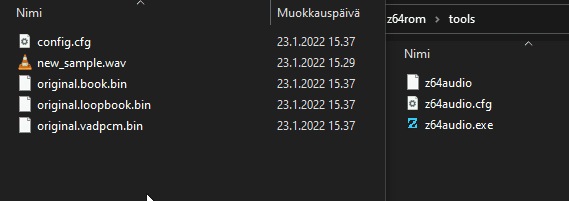

# z64rom

### Build

The first step is to dump the rom. This will be done with drag and dropping the `[.z64]` rom file on to `z64rom` application. After that you can perform build just by opening `z64rom` application.

### Converting Samples

`z64audio` utilizes extra info carried by sample formats like `WAV` and `AIFF`. Such information being `instrument information`, like `basenote`, `finetune` and `loop region`.
In order to take full advantage of this, make sure you have capable audio editor like `Edison` that is provided in FL Studio.

To convert the samples, set your sample in the directory you want to replace, for example `rom/sound/sample/Amb_Wind/`, and then drag and drop the file on top of `z64audio` to convert it to audio binaries.



This will also modify the `config.cfg` so that it'll `override` SoundFont instrument tuning value.
```ini
# new_sample
codec           = 0
medium          = 0
bitA            = 0
bitB            = 0

# Loop
loop_start      = 1233
loop_end        = 41803
loop_count      = -1
tail_end        = 41808

# Instrument Info
tuning          = 0.684600
```
This tuning value is calculated by using the `samplerate` and `basenote + finetune` information from the sample. But if you do not want to use this `tuning override` feature, just delete this part from the config file:
```ini
# Instrument Info
tuning          = 0.684600
```
In this case `z64rom` will rely on the tuning values inside the `SoundFont instruments`.

### Bugs?

Join Hylian Modding discord and contact me `rankaisija#1105`
